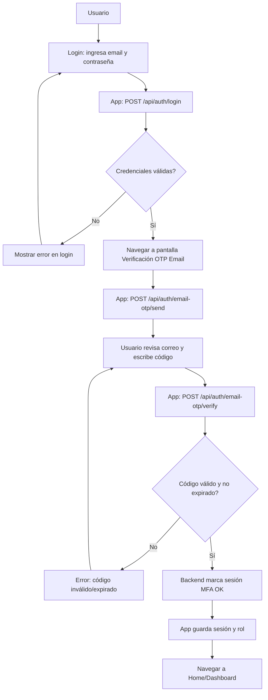
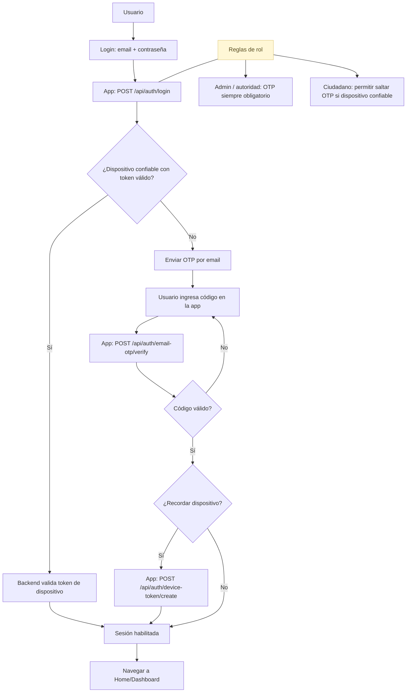
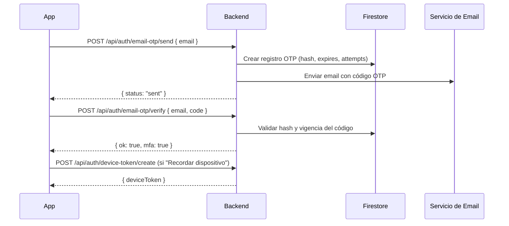

# Diagramas de Proceso – Autenticación y 2FA

Este documento describe el proceso actual de autenticación de la app y el proceso propuesto con mejoras de 2FA (OTP por email) y "Recordar dispositivo".

## Proceso Actual (Login con OTP por Email)

Notas:
- OTP se envía al email del usuario tras login con contraseña válida.
- La sesión se habilita solo tras verificar el código.

## Proceso Propuesto (Con "Recordar dispositivo" y reglas por rol)

Notas:
- "Recordar dispositivo" emite un token firmado que se valida en logins futuros.
- Para roles sensibles (admin/autoridad), OTP es obligatorio en cada login o acción de alto riesgo.

## Secuencia de Verificación OTP (Propuesto)

## Endpoints involucrados
- `POST /api/auth/login`: valida credenciales y determina si requiere MFA.
- `POST /api/auth/email-otp/send`: genera y envía el código al correo.
- `POST /api/auth/email-otp/verify`: verifica código, marca sesión MFA.
- `POST /api/auth/device-token/create`: emite token de dispositivo confiable.

## Consideraciones de seguridad
- Limitar intentos y expiración de OTP.
- Almacenar OTP como hash (no en texto plano).
- Firmar el token de dispositivo y expirar/invalidar en revocaciones.
- Auditar intentos de login, verificación OTP y creación/uso de tokens.

## Próximas extensiones (opcional)
- Añadir diagrama de proceso para acciones sensibles (cambio de rol, edición crítica).
- Incluir Passkeys/WebAuthn para web como mejora a medio plazo.