# Vista de Proceso – Actual (sin app) vs Propuesto (con app)

Este documento muestra, a nivel negocio, cómo funciona el proceso de atención de incidentes de seguridad ciudadana actualmente (sin la app) y cómo lo mejorará la app propuesta.

## Proceso Actual (sin app)

```mermaid
graph LR
    linkStyle default stroke:#64748b,stroke-width:2px
    classDef ciudadano fill:#E8F0FE,stroke:#1E3A8A,color:#0F172A,stroke-width:1px
    classDef callcenter fill:#FFF7ED,stroke:#C2410C,color:#0F172A,stroke-width:1px
    classDef fuerzas fill:#ECFDF5,stroke:#065F46,color:#0F172A,stroke-width:1px
    classDef registro fill:#F1F5F9,stroke:#0F172A,color:#0F172A,stroke-width:1px

    subgraph Ciudadano
        direction TB
        A1[Incidente ocurre]
        A2[Reporta por llamada telefónica o visita física]
        A1 --> A2
        class A1,A2 ciudadano
    end

    subgraph Centro_de_Atencion_CallCenter
        direction TB
        B1[Operador atiende llamada]
        B2[Registra datos en papel / Excel]
        B3[Triage manual: tipo, severidad, ubicación]
        B4[Despacha vía teléfono/radio a unidades]
        B5[Seguimiento por llamadas]
        B1 --> B2 --> B3 --> B4 --> B5
        class B1,B2,B3,B4,B5 callcenter
    end

    subgraph Fuerzas_de_Respuesta
        direction TB
        C1[Serenazgo / Policía]
        C2[Movilización y atención en campo]
        C3[Reporte de cierre manual al centro]
        C1 --> C2 --> C3
        class C1,C2,C3 fuerzas
    end

    subgraph Registro_y_Seguimiento
        direction TB
        D1[Actualización manual del estado]
        D2[Cierre de caso]
        D3[Archivo físico / Excel]
        D1 --> D2 --> D3
        class D1,D2,D3 registro
    end

    A2 --> B1
    B4 --> C1
    C3 --> B5
    B5 --> D1
```



Limitaciones del proceso actual:
- Alto uso de llamadas y registros manuales (papel/Excel), con riesgo de errores.
- Triage y despacho manuales, posibles demoras y duplicidades.
- Trazabilidad limitada: estados no actualizados en tiempo real.
- Dificultad para analítica y generación de KPIs.

## Proceso Propuesto (con la app)

```mermaid
graph LR
    linkStyle default stroke:#64748b,stroke-width:2px
    classDef ciudadano fill:#E8F0FE,stroke:#1E3A8A,color:#0F172A,stroke-width:1px
    classDef backend fill:#F0FDFA,stroke:#155E75,color:#0F172A,stroke-width:1px
    classDef monitoreo fill:#FEF3C7,stroke:#92400E,color:#0F172A,stroke-width:1px
    classDef fuerzas fill:#ECFDF5,stroke:#065F46,color:#0F172A,stroke-width:1px
    classDef analitica fill:#EEF2FF,stroke:#4F46E5,color:#0F172A,stroke-width:1px

    subgraph Ciudadano_App
        direction TB
        A1[Incidente ocurre]
        A2[Reporta en la app: texto, fotos, video]
        A3[Geolocalizacion automática y datos del dispositivo]
        A4[Recibe confirmación y seguimiento]
        A1 --> A2 --> A3 --> A4
        class A1,A2,A3,A4 ciudadano
    end

    subgraph Backend_API
        direction TB
        B1[Recepción del reporte]
        B2[Validación básica / antifraude]
        B3[Clasificación: tipo/severidad/prioridad]
        B4[Enrutamiento a Centro de Monitoreo]
        B1 --> B2 --> B3 --> B4
        class B1,B2,B3,B4 backend
    end

    subgraph Centro_de_Monitoreo
        direction TB
        C1[Operador visualiza reporte en tiempo real]
        C2[Triage asistido (mapa, historial, fotos)]
        C3[Asignación a unidades disponibles]
        C4[Monitoreo de estado y tiempos]
        C1 --> C2 --> C3 --> C4
        class C1,C2,C3,C4 monitoreo
    end

    subgraph Fuerzas_de_Respuesta
        direction TB
        D1[Serenazgo / Policía / Bomberos / Salud]
        D2[Reciben despacho con ubicación GPS]
        D3[Actualizan estado desde campo]
        D4[Cierre del caso con evidencia]
        D1 --> D2 --> D3 --> D4
        class D1,D2,D3,D4 fuerzas
    end

    subgraph Notificaciones_y_Analitica
        direction TB
        E1[Notificaciones push/email a ciudadano]
        E2[Tableros de KPI y mapas de calor]
        E3[Auditoría y trazabilidad completa]
        E1 --> E2 --> E3
        class E1,E2,E3 analitica
    end

    A2 --> B1
    B4 --> C1
    C3 --> D1
    D3 --> C4
    D4 --> E1
    B3 --> E2
    E3 -. retroalimentación .-> B2
```

Mejoras clave del proceso propuesto:
- Captura estructurada y geolocalizada del reporte desde el ciudadano.
- Triage asistido y enrutamiento inteligente, reduciendo tiempos y errores.
- Despacho con ubicación precisa y actualización de estado en tiempo real.
- Trazabilidad end-to-end y analítica (KPIs, mapa de calor, tiempos de respuesta).
- Comunicación bidireccional con el ciudadano (notificaciones y cierre).

## Roles y responsabilidades (alto nivel)
- `Ciudadano`: reporta incidentes y recibe actualizaciones.
- `Centro de Monitoreo`: triage, asignación y seguimiento.
- `Fuerzas de Respuesta`: atención en campo y actualización de estados.
- `Backend/API`: validación, clasificación, enrutamiento, almacenamiento y seguridad.
- `Analítica`: KPIs, auditoría y mejora continua.

## Supuestos
- La app está integrada con servicios de notificaciones, mapas y almacenamiento seguro.
- Existen protocolos de despacho entre Centro de Monitoreo y Fuerzas de Respuesta.
- Se respeta la normativa local de protección de datos y cadena de custodia.

## Próximos diagramas (opcional)
- BPMN detallado por subproceso (reporte, despacho, cierre).
- Diagrama de estados del caso (Nuevo, Asignado, En curso, Cerrado, Reabierto).
- Diagrama de arquitectura técnica (móvil, backend, base de datos, integraciones).